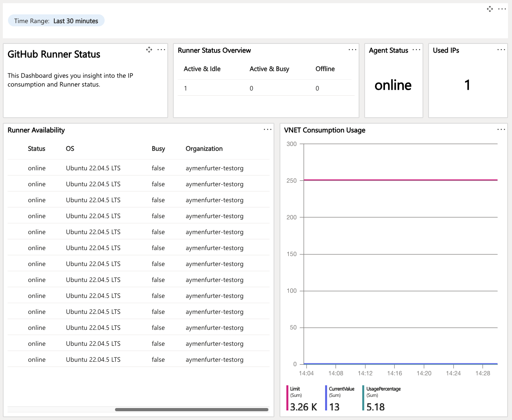
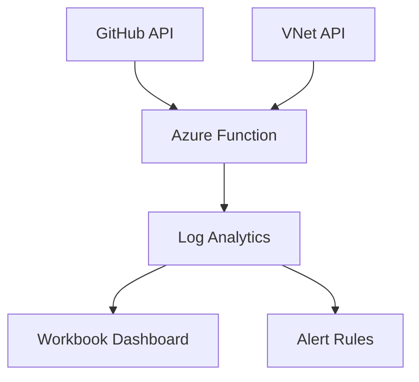

<div align="center">
  
  <h1>GitHub Runners Monitoring</h1>
  
  <p><strong>Real-time monitoring solution for GitHub Actions VNET-injected runners</strong></p>
  
  [](https://azure.microsoft.com)
  [](https://python.org)
  [](LICENSE)
  
  [Quickstart](#-quickstart) •
  [Features](#-key-features) •
  [Architecture](#%EF%B8%8F-architecture) •
  [Installation](#-installation) •
  [API](#-api-integrations)
</div>

---

## Overview

A monitoring and alerting solution for GitHub Actions runners using Azure Functions and Log Analytics. Track runner status, detect offline runners, and monitor VNet IP usage in real-time.

> **Note**: While the data flow has been validated, the alerting functionality requires production testing. Use in production environments at your own discretion.

## 🚀 Quickstart

1. **Configure Environment**
   ```bash
   # Update deployment script with your values
   GITHUB_TOKEN_VALUE="<GITHUB_TOKEN>"
   GITHUB_ORG="<GITHUB_ORG>"
   AZURE_TARGET_VNET_NAME="<VNET_NAME>"
   ```

2. **Deploy Resources**
   ```bash
   ./scripts/deploy.sh
   ```

## ✨ Key Features

- **Real-time Monitoring**
  - Runner status tracking (5-minute intervals)
  - VNet usage analysis
  - Offline runner detection

- **Azure Integration**
  - Custom Log Analytics tables
  - Pre-built workbook dashboard
  - Customizable alert rules

## 🔑 Required Permissions

### GitHub Permissions
- `admin:org` scope (OAuth tokens)
- Organization admin access
- Runner read permissions

### Azure Permissions
- Virtual Network read access
- RBAC permissions:
  ```
  Microsoft.Network/virtualNetworks/read
  Microsoft.Network/virtualNetworks/usages/read
  ```

## 📊 API Integrations

### GitHub Actions API

```json
{
    "success": true,
    "message": "All runners online",
    "details": {
        "total_runners": 3,
        "offline_count": 0,
        "runner_statuses": [
            {
                "TimeGenerated": "2025-01-15T13:52:45Z",
                "RunnerId_s": "35",
                "Name_s": "runner_149f511b76f6",
                "Status_s": "online",
                "OS_s": "Ubuntu 22.04.5 LTS",
                "Busy_b": false,
                "Labels_s": "[]",
                "Organization_s": "your-org-name"
            }
        ]
    }
}
```

### Azure VNet API

```json
{
    "success": true,
    "message": "All VNet usages are within threshold.",
    "details": {
        "vnet_usages": [
            {
                "TimeGenerated": "2025-01-15T13:58:54.062386Z",
                "SubscriptionId_s": "subscription-id",
                "ResourceGroupName_s": "your-resource-group",
                "VNetName_s": "your-vnet-name",
                "UsageName_s": "SubnetSpace",
                "CurrentValue_d": 1,
                "Limit_d": 251,
                "Unit_s": "Count",
                "UsagePct_d": 0.398406374501992,
                "Type": "VNetUsage_CL"
            }
        ]
    }
}
```

## ⚙️ Architecture



## 📦 Installation

```bash
# Clone repository
git clone https://github.com/yourusername/github-runners-monitoring

# Deploy all components
./scripts/deploy.sh all

# Or deploy individual components
./scripts/deploy.sh [rg|storage|keyvault|function|loganalytics|alert]
```

## 🔍 Monitoring Configuration

### Runner Status Checks
- 5-minute intervals
- Online/Offline status
- Busy state tracking
- Label configuration

### VNet Usage Monitoring
- IP address consumption
- Usage thresholds
- Historical trends

## 🚨 Alert Rules

### Runner Availability
```kusto
let timeRange = 30m;
let latestData = GHRunnerStatus_CL
| where TimeGenerated > ago(timeRange)
| where Status_s == 'online'
| summarize OnlineCount=dcount(Name_s);
latestData
| where OnlineCount == 0
| project TimeGenerated=now(),
    ['Message']='No online runners found in the last 30 minutes'
```

### VNet Usage
```kusto
VNetUsage_CL 
| where UsagePct_d > 80
| summarize ThresholdCount=count() by bin(TimeGenerated, 5m), VNetName_s, UsageName_s
| where ThresholdCount > 0
```

## 🌐 Environment Variables

```bash
# Required configuration
GITHUB_ORG="your-organization"
GITHUB_TOKEN_SECRET_NAME="GH-TOKEN"
AZURE_TARGET_VNET_NAME="your-vnet"
SUBSCRIPTION_ID="your-subscription-id"
DATA_COLLECTION_ENDPOINT="your-dce-endpoint"
LOGS_DCR_RULE_ID="your-dcr-id"
LOGS_DCR_STREAM_NAME_RUNNER="Custom-GHRunnerStatus_CL"
LOGS_DCR_STREAM_NAME_VNET="Custom-VNetUsage_CL"
```

## 📚 Resources

- [Private Networking Documentation](https://docs.github.com/en/enterprise-cloud@latest/admin/configuring-settings/configuring-private-networking-for-hosted-compute-products)
- [GitHub Actions Runners API](https://docs.github.com/en/rest/actions/self-hosted-runners)
- [Azure Virtual Network Docs](https://docs.microsoft.com/en-us/azure/virtual-network/virtual-networks-overview)